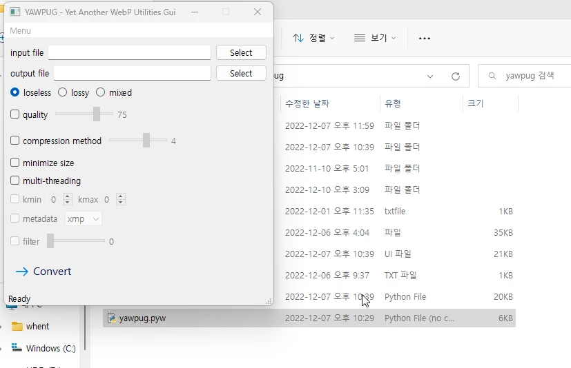

# YAWPUG
**Y**et **A**nother **W**eb**P** **U**tilities **G**ui: GUI for WebP Utilities using [Qt for Python(PySide6)](https://doc.qt.io/qtforpython/).
This program is aim to provide you an easy method for GIF to WebP converting.

## Setup
1. Install Python 3.7+ (64-bit), making sure to add it to your PATH.
2. [Download ZIP](https://github.com/uaevuon/YAWPUG/archive/refs/heads/main.zip) of this repository.
3. Run `pip install -r requirements.txt`.

## Usage

Run `yawpug.pyw`.

Select input GIF file which you want to convert to WebP.

Output WebP file has same file name with .webp extension automatically. If you want to change it, select other output file.

Select options which you want to set. For advanced options (kmin, kmax, metadata, filter), enable `Advanced options` under Menu.

| Input GIF file for demo | Output WebP file for demo |
| :---: | :---: |
|   |   |
| 4.47 MB | 809 kB (-80.6%)  |

## TODO
* batch mode

## License
This software is licensed under the GNU General Public License v3.0.
The source is publicly available on [GitHub](https://github.com/uaevuon/yawpug).
