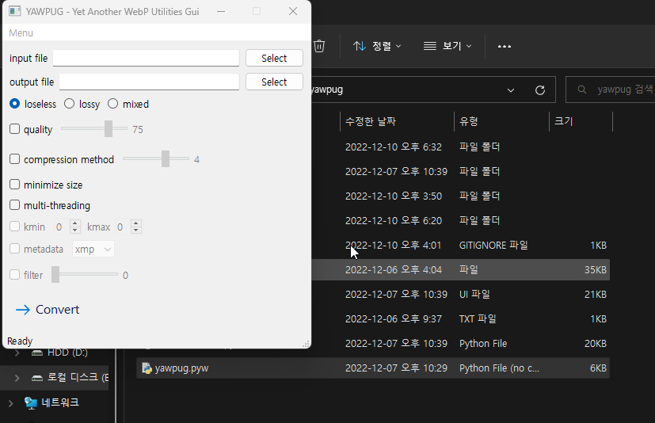

# YAWPUG
**Y**et **A**nother **W**eb**P** **U**tilities **G**ui: GUI for WebP Utilities using [Qt for Python(PySide6)](https://doc.qt.io/qtforpython/).

This program aims to provide you an easy method for GIF to WebP converting.

WebP is a modern image format that provides superior lossless and lossy compression for images on the web. [More information about WebP](https://developers.google.com/speed/webp)

## Setup
1. Install Python 3.7+ (64-bit), making sure to add it to your PATH.
2. [Download ZIP](https://github.com/uaevuon/YAWPUG/archive/refs/heads/main.zip) of this repository.
3. Run `pip install -r requirements.txt`.

## Usage

1. Run `yawpug.pyw`.
2. Select input GIF file which you want to convert to WebP.
Automatically, output WebP file will have same file name with .webp extension. If you want to change it, select output file manually.
3. Select options which you want to set. You can see the tooltip for each options if you hover the cursor on them. For advanced options (kmin, kmax, metadata, filter), enable `Advanced options` under Menu.
4. Click Convert.

### Comparison
| Input GIF file for demo | Output WebP file for demo |
| :---: | :---: |
|   |   |
| 4.47 MB | 889 KB (-80.6%)  |

## TODO

## License

This software is licensed under the GNU General Public License v3.0.
The source is publicly available on [GitHub](https://github.com/uaevuon/yawpug).
